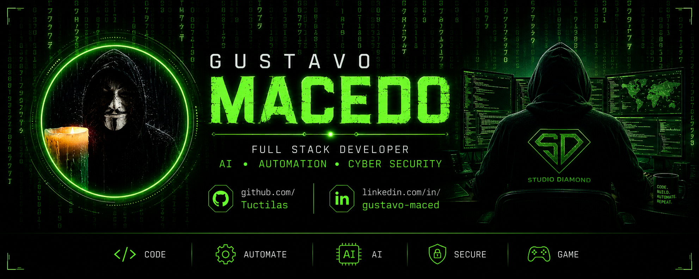

  

<h1 align="center">Gustavo Macedo</h1>

Full Stack Developer • AI • Automation • Cyber Security

---

# 🚀 Sobre Mim

Desenvolvedor apaixonado por tecnologia, automação e criação de soluções digitais.

* 🌐 Desenvolvimento Full Stack
* 🤖 Inteligência Artificial
* ⚡ Automação de Processos
* 🔒 Cyber Security
* ☁️ Cloud Computing
* 🎮 Projetos Gamer

---

# 💻 Tecnologias

---

# 📊 GitHub Stats

---

# 🔥 GitHub Streak

---

# 🏆 GitHub Trophies

---

# 🚀 Projetos em Destaque

---

# 📈 Atividade

---

# 👀 Visitantes

---

# 🐍 Contribution Snake

---

### ⚡ Code. Build. Automate. Repeat.

